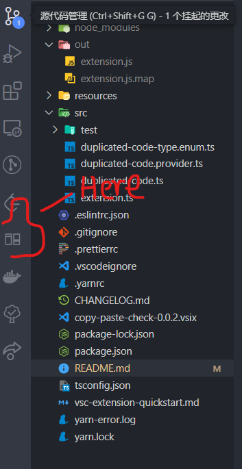

# copy-paste-check (duplicated-code)

FIXED https://github.com/paulomenezes/vscode-duplicated-code-extension in windows, get nothing.

[已上传市场, yobraveLee.copy-paste-check](https://marketplace.visualstudio.com/items?itemName=yobraveLee.copy-paste-check)

## Look

## command

- duplicatedCode.openFile